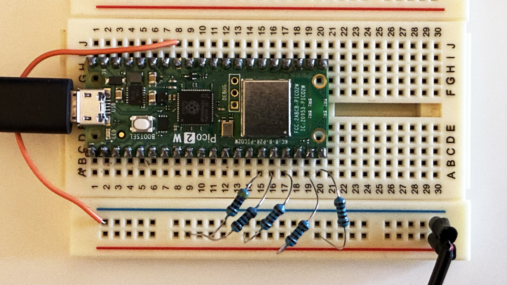

# Raspberry Pi Pico Async Music Player (8-bit ChipSound Tracker)

This is the perfect music player library for retro games etc on the Raspberry Pi Pico.

It has four sound channels that can produce square waves using PWM (Pulse Width Modulation) plus a percussion channel that produce 8-bit Nintendo NES inspired drums using the built in state machines and PIO.

It can play asyncronously in the background using the second core, or syncronously.

Asyncronous play is great for playing music during gameplay, and syncronous is great for when you want to play during a Game Over screen or something, where you want to play a tune and then exit the screen when the music stops.

## Background
I grew up in the 80:s. and surrounded by the distinct 8-bit sounds of The NES and the incredible SID chip in thhe C-64.

When I later got an Amiga, I started making music in trackers like "Sound Tracker" and "Noise Tracker.

This is what inspired me to make a music player for the Pi Pico, reproducing the simple squarewaves and noise percussions using a pattern format inspired by the Amiga trackers.

## How it works
Each channel uses it's own pin to generate the sound, and they are then mixed together using simple resistors and wired to a speaker.

## Wiring
In my example, I use Pin 11 for the percussion channel and pins 12-15 for the PWM square waves.

All pins are wired through a resistor to the + terminal of the speaker.

For pins 12-15, I ise 1k resistors and for Pin 11, I use a 470Ohm resistor. This is because since the square waves are 50% duty cycle, they are louder, and will drown out the percussions. You can experiment with different resistor values or use potentiometers to be able to dynamically mix the channels.

The - terminal of the speaker is connected to ground.

Optionally, you can add a 0.1 µF or so capacitor in parallell with the speaker as a low pass filter, but I didn't deem it necessary for my simple wiring example.

Obviously, for serious implementations, you will probably want to impedance match properly and use an amplifier for the sound instead of using this simple (but surprisingly well working) hacky wiring.



## Pattern format
The format of the notation is inspired by the trackers like sound trackers on the Amiga.

Each row represents a tick with the length of a 16th note.

For each tick, we can start playing one or more notes or percussions, or do nothing.

Each tick has five columns, each corresponding to one of the four square wave channels and the dedicated percussion channel.

Each column consists of 5 characters and are delimited by a space.

Example of a row:
```
D-401 F#401 A-401 ----- D--16
```
The square wave channels can play any note with a duration of a whole note, a half note, a quarter note, an eighth note and a sixteenth note and the percussion channel can play either a "drum" or a "cymbal" sound. The format is similar, but there are some differences.

For both square wave channels and the percussion channel, '-----' means no change, i.e. if a note or drum is playing, keep playing it, and if it's not playing keep quiet.

### Square wave channels:

- Character 1: The note, i.e. C
- Character 2: If the note is natural (-), sharp (#) or flat (b).
- Character 3: The octave, where 4 is the middle octave
- Character 4-5: The the fraction part of the length of the note. Whole note (1/1) = 01, half note (1/2) = 02, quarter note (1/4) = 04, eigth note (1/8) = 08 and 16th note (1/16) = 16.

So, for example, "C-404" means play a quarter note of the middle c.

### Percussion channels:
The percussion channels look similar but works a bit differently.

- Character 1: The drum type. Can be D or C. D means a drum-like sound and C means a more cymbal like sound.
- Character 2: N/A (always -)
- Character 3: N/A (always -)
- Character 4-5: The the fraction part of the length of the drum. Whole note (1/1) = 01, half note (1/2) = 02, quarter note (1/4) = 04, eigth note (1/8) = 08 and 16th note (1/16) = 16.

## Example implementation
The example.py has an example implementation that shows how you can create a pattern (the included pattern plays some chords and arpeggios accompanied by a simple drum pattern) and play it both asynchronously and synchronously and with and without looping.

Just add the "PWMTracker.py" to your pico and you can run the example.py from within Thonny.
